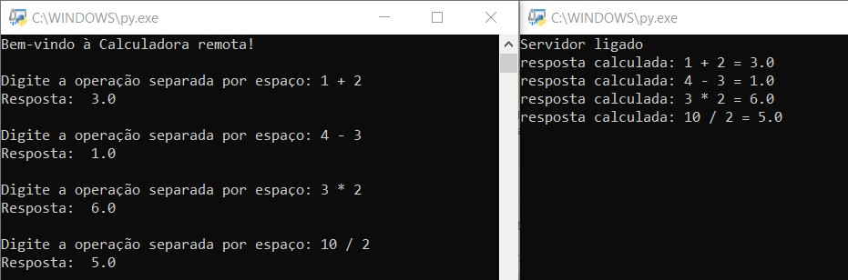

# Calculadora Remota

Projeto construído na disciplina de Sistemas Distribuídos do Curso de Engenharia de Computação da Universidade Federal do Ceará.

### **Requisitos do Projeto:**
Utilizando UDP, implementar uma
calculadora remota que execute as 4 operações básicas (+,-,∙,÷) de números decimais.
Descreva o formato para cada tipo de mensagem (Request e Response).

## 💡 Instalação & Execução
 1. Instalar o [Python](https://www.python.org/downloads/) ;
 2. Baixar o programa em "Code" > "Download ZIP" ou utilizando o comando "git clone https://github.com/andreluizigal/calculadora-remota.git" em um terminal aberto na pasta destino;
 3. Executar o arquivo "servidor_calculadora.py";
 4. Executar o arquivo "cliente_calculadora.py";
 5. Digitar a operação desejada no programa do cliente.

## 🛠️ Tecnologias
- Python
    - Socket
- Git

## 📞 Contato
- [andreluizigal@gmail.com 📧](mailto:andreluizigal@gmail.com)

- [(85) 99985-1991 ☎️](https://wa.me/5585999851991)
